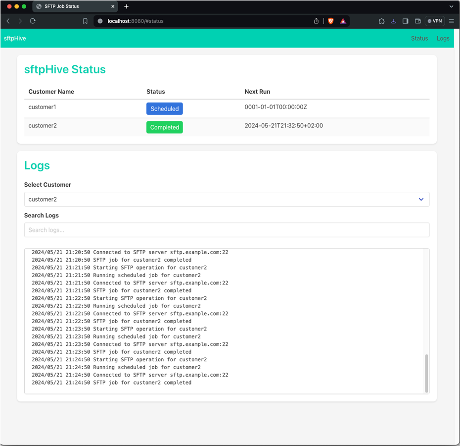

## Overview

sftpHive is a Go-based application for managing SFTP file transfers for multiple customers. It supports both scheduled and on-demand transfers, and includes a web server for monitoring job statuses and viewing logs.



## Directory Structure

```
sftphive/
│
├── config/
│ └── config.go
│
├── sftp/
│ ├── upload.go
│ ├── download.go
│ └── cleanup.go
│
├── static/
│ └── index.html
│
├── main/
│ └── main.go
├── server/
│ └── server.go
├── go.mod
└── configs.json
```

## Encrypting the SFTP Password

To avoid storing the SFTP password in cleartext, you can use the provided encryption utility. This utility encrypts the password and outputs the encrypted version, which you can then use in your configuration file.

### Change encryption key

1. Change encryption key for the generation in:
```
utils/encrypt.go
```
Change this part
```bash
key := "aReaLlYHaxxIEncryptionKey"
```
2. Do the same in main/main.go under the "runSFTPJob" function.
```bash
    key := "mysecretencryptionkey"
```

### Using the Encryption Utility for storing password in a little better way.

1. Navigate to the directory containing the `encrypt.go` file.

2. Run the following command, replacing `customer_sftp_password` with the actual SFTP password you want to encrypt:

    ```bash
    go run encrypt.go -password "customer_sftp_password"
    ```

3. The utility will output the encrypted password. Copy this encrypted password.

4. Replace the `SftpPassword` field in your `configs.json` with the encrypted password.

### Example

```json
{
    "customer1": {
        "LocalPath": "/local/path",
        "RemotePath": "/remote/path",
        "SftpServer": "sftp.example.com",
        "SftpPort": "22",
        "SftpUserName": "username",
        "SftpPassword": "ENCRYPTED_PASSWORD",
        "LogFilePath": "/path/to/logs",
        "ArchivePath": "/path/to/archive",
        "DeleteFoldersAfterArchive": true,
        "FileExtensions": "txt,csv",
        "CleanupThresholdDays": 90,
        "UploadRootOnly": false,
        "TempRemotePath": "/temp/path",
        "UseTempFolder": true,
        "NewExtension": ".bak",
        "DownloadEnabled": true,
        "DownloadRemotePath": "/download/path",
        "DownloadLocalPath": "/download/local/path",
        "DownloadFileExtensions": "txt,csv",
        "DownloadRootOnly": false,
        "DeleteRemoteFileAfterDownload": true,
        "Schedule": "@daily"
    }
}

## Configuration

The `configs.json` file contains configurations for each customer. Below is an example configuration:

```json
{
    "customer1": {
        "LocalPath": "/local/path",
        "RemotePath": "/remote/path",
        "SftpServer": "sftp.example.com",
        "SftpPort": "22",
        "SftpUserName": "username",
        "SftpPassword": "ENCRYPTED_PASSWORD",
        "LogFilePath": "/path/to/logs",
        "ArchivePath": "/path/to/archive",
        "DeleteFoldersAfterArchive": true,
        "FileExtensions": "txt,csv",
        "CleanupThresholdDays": 90,
        "UploadRootOnly": false,
        "TempRemotePath": "/temp/path",
        "UseTempFolder": true,
        "NewExtension": ".bak",
        "DownloadEnabled": true,
        "DownloadRemotePath": "/download/path",
        "DownloadLocalPath": "/download/local/path",
        "DownloadFileExtensions": "txt,csv",
        "DownloadRootOnly": false,
        "DeleteRemoteFileAfterDownload": true,
        "Schedule": "@daily"
    },
    "customer2": {
        "LocalPath": "/local/path",
        "RemotePath": "/remote/path",
        "SftpServer": "sftp.example.com",
        "SftpPort": "22",
        "SftpUserName": "username",
        "SftpPassword": "ENCRYPTED_PASSWORD",
        "LogFilePath": "/path/to/logs",
        "ArchivePath": "/path/to/archive",
        "DeleteFoldersAfterArchive": true,
        "FileExtensions": "txt,csv",
        "CleanupThresholdDays": 90,
        "UploadRootOnly": false,
        "TempRemotePath": "/temp/path",
        "UseTempFolder": true,
        "NewExtension": ".bak",
        "DownloadEnabled": true,
        "DownloadRemotePath": "/download/path",
        "DownloadLocalPath": "/download/local/path",
        "DownloadFileExtensions": "txt,csv",
        "DownloadRootOnly": false,
        "DeleteRemoteFileAfterDownload": true,
        "Schedule": "@daily"
    }

}
```

### Schedule Jobs - Settings

The Schedule field in the configuration file allows you to specify when the job should run. This uses the cron format, supported by the robfig/cron package. Here are some examples:

```bash
@daily: Run once a day.
@hourly: Run once an hour.
@every 1h30m: Run every 1 hour and 30 minutes.
@every 0h15m: Run every 15 minutes.
0 30 * * * *: Run every hour at minute 30.
0 0 9 * * *: Run every day at 9 AM.
```

## Running the Main Application

The main application handles SFTP job execution and scheduling. You can run it with or without the scheduler.

### Running with Scheduler
```bash
cd main
go run main.go
```

### Running for a Single Customer

```bash
cd main
go run main.go --customer <customerName> --skip-scheduler
```

Replace <customerName> with the name of the customer as specified in configs.json.

## Running the Web Server

The web server provides a UI for monitoring job statuses and viewing logs.

```bash
cd server
go run server.go
```

### Accessing the Web Interface

Open a web browser and navigate to http://localhost:8080 to view the status of the scheduled jobs and logs.

### Web Interface
The web interface uses Bootstrap for styling and jQuery for dynamic content updates. It provides a simple table to display job statuses and a section to view logs.

## Dependencies

Ensure you have the following Go packages installed:
```bash
github.com/robfig/cron/v3
github.com/pkg/sftp
```

## Building the Project

To build the project, you can use the Go build command:
```bash
go build -o sftphive main/main.go
```
```bash
go build -o sftphive-server server/server.go
```

Password encryption
```bash
go run utils.go -password "customer_sftp_password"
```

This will create two executable files, sftphive and sftphive-server, which you can run to start the main application and the web server, respectively.